# Navigation Behaviour Tree — Structure Reference

## How these fit together

```
Task trees  (one per challenge: HRI / P&P / GPSR)
    └─ call shared Subtrees  (APPROACH_PERSON, DOOR_APPROACH_AND_CROSS, etc.)
           └─ call Custom Nodes  (Bucket B: leaves with real logic)
                  └─ call Action Servers  (Bucket A: Nav2 /navigate_to_pose, /spin, etc.)
```

- **Task trees** are the entry point selected at runtime by the task manager.
- **Subtrees** are reusable compositions — XML only, no new C++ code.
- **Custom Nodes** are C++ leaves (thin wrappers + real-logic nodes).
- **Action Servers** (Nav2 built-ins) are called by thin wrapper leaves, never merged into your tree.
- `→` = Sequence (all must succeed),  `?` = Fallback (try until one succeeds),  `leaf` = action/condition node.

---

## 1 — Shared Subtrees

### 1a. APPROACH_PERSON
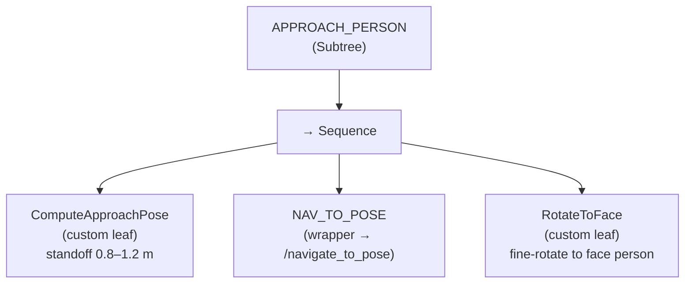

### 1b. FOLLOW_PERSON  *(single async leaf — not a subtree)*
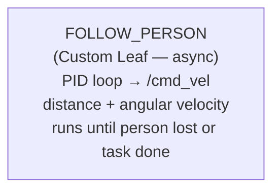

### 1c. REACQUIRE_PERSON
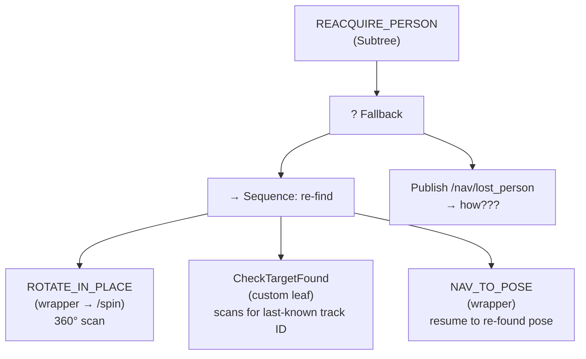

### 1d. DOOR_APPROACH_AND_CROSS
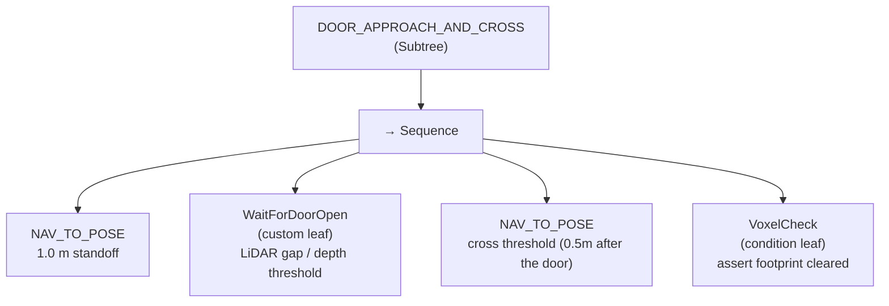
VoxelCheck — a condition leaf you run after crossing. The voxel layer (your 3D depth costmap) can still see ghost inflation from the door frame edges, the door itself if it swung into the path, or a person who stepped into the doorway during crossing. VoxelCheck asserts that the footprint at the robot's current pose is actually clear in the voxel layer before the sequence considers the door crossing done. If it's not clear, the Sequence fails and your recovery Fallback (one level up) handles it — e.g. back up and retry. Without this check you could proceed into the next task while the costmap still thinks you're partially inside an obstacle, which breaks subsequent planning.


### 1e. PRECISE_PLACEMENT_APPROACH
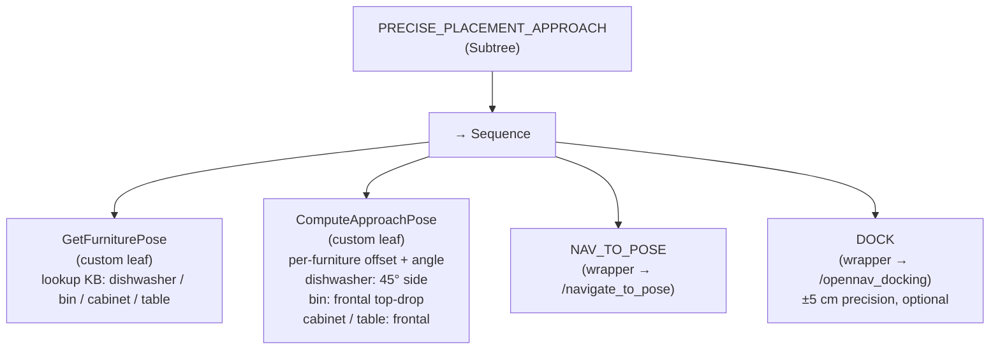

### 1f. ROOM_SCAN
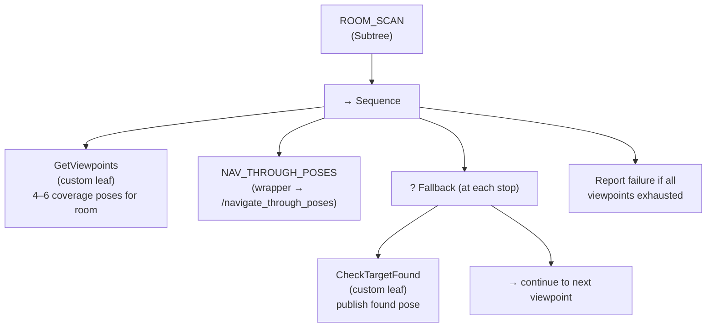

---

## 2 — Task Trees

### 2a. HRI Task Tree
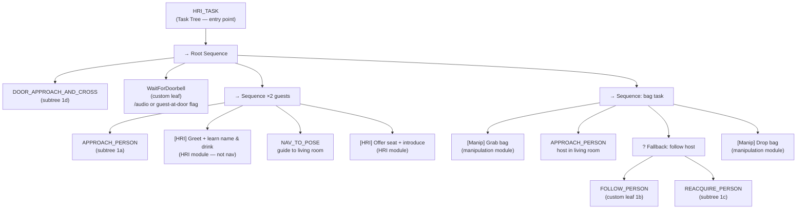

### 2b. P&P Task Tree
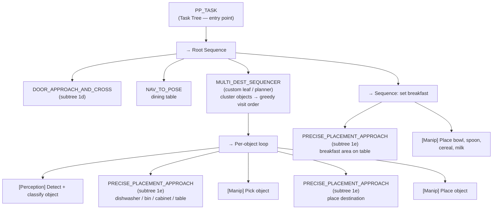

### 2c. GPSR Task Tree
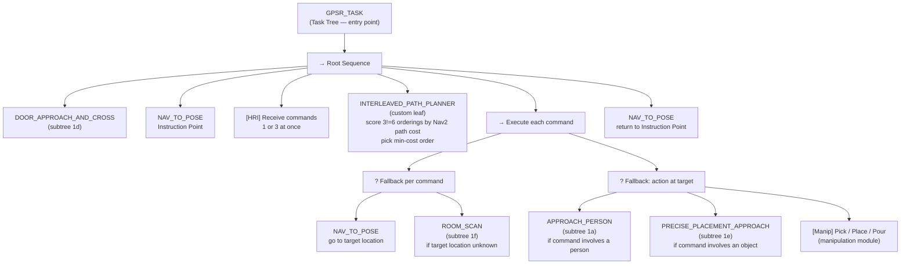

---

## 3 — Custom Node Catalogue (Bucket B)

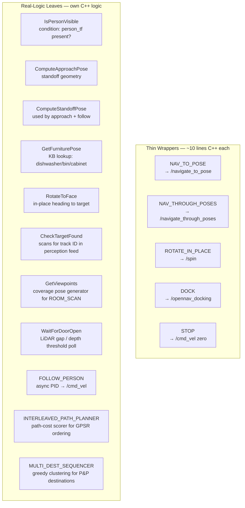

---

## 4 — Action Servers (Bucket A — Nav2 built-ins, never merged into your tree)

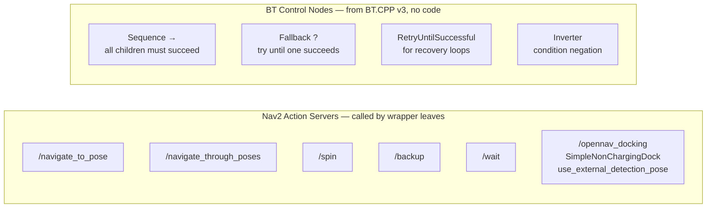
