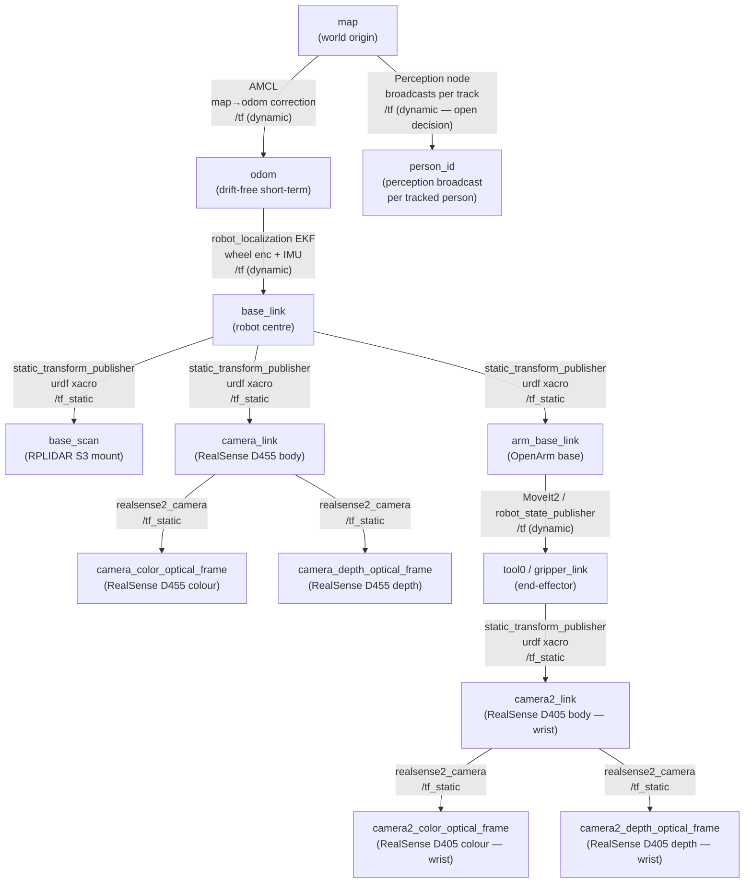

# BT Node I/O & TF Tree Reference

---

## Section 1 — Custom Node I/O

> **Conventions**
> - All poses are in `map` frame unless noted.
> - `→` = publishes / sends.  `←` = subscribes / reads.
> - Action wrappers (NAV_TO_POSE etc.) send a Goal and receive a Result — listed as Goal/Result not pub/sub.
> - BT ports (input/output blackboard keys) listed where relevant.

---

### Thin Wrappers (Bucket B — ~10 lines C++ each)

#### NAV_TO_POSE
| Direction | Topic / Action | Message Type | Frame |
|-----------|---------------|-------------|-------|
| Goal → | `/navigate_to_pose` (action) | `nav2_msgs/action/NavigateToPose` | `map` |
| ← Feedback | `/navigate_to_pose/_action/feedback` | `nav2_msgs/action/NavigateToPose_FeedbackMessage` | `map` |
| Result ← | success / failure | — | — |
| BT input port | `goal` (PoseStamped) | `geometry_msgs/PoseStamped` | `map` |

#### NAV_THROUGH_POSES
| Direction | Topic / Action | Message Type | Frame |
|-----------|---------------|-------------|-------|
| Goal → | `/navigate_through_poses` (action) | `nav2_msgs/action/NavigateThroughPoses` | `map` |
| Result ← | success / failure | — | — |
| BT input port | `poses` (array) | `geometry_msgs/PoseStamped[]` | `map` |

#### ROTATE_IN_PLACE
| Direction | Topic / Action | Message Type | Frame |
|-----------|---------------|-------------|-------|
| Goal → | `/spin` (action) | `nav2_msgs/action/Spin` | — |
| BT input port | `target_yaw` (float, radians) | — | `base_link` |

#### DOCK
| Direction | Topic / Action | Message Type | Frame |
|-----------|---------------|-------------|-------|
| Goal → | `/dock_robot` (action) | `opennav_docking_msgs/action/DockRobot` | — |
| ← Detection pose | `/perception/dock_pose` or external | `geometry_msgs/PoseStamped` | `map` |
| BT input port | `dock_id` (string), `dock_pose` (PoseStamped) | — | `map` |

#### STOP
| Direction | Topic / Action | Message Type | Frame |
|-----------|---------------|-------------|-------|
| → | `/cmd_vel` | `geometry_msgs/Twist` | `base_link` |
| Note | Publishes zero Twist once, then returns SUCCESS | — | — |

---

### Real-Logic Leaves (Bucket B — own C++ logic)

#### IsPersonVisible
| Direction | Topic | Message Type | Frame |
|-----------|-------|-------------|-------|
| ← | `/perception/people` | `vision_msgs/Detection3DArray` (persistent `track_id` in `results[].id`) | `map` |
| BT input port | `track_id` (string) | — | — |
| BT output port | `person_pose` (PoseStamped) | `geometry_msgs/PoseStamped` | `map` |
| Returns | SUCCESS if track present, FAILURE if absent | — | — |

#### ComputeApproachPose
| Direction | Topic / Service | Message Type | Frame |
|-----------|----------------|-------------|-------|
| ← person pose | BT blackboard (`person_pose`) or `/perception/people` | `geometry_msgs/PoseStamped` | `map` |
| ← furniture pose | BT blackboard (`furniture_pose`) | `geometry_msgs/PoseStamped` | `map` |
| BT input port | `target_pose`, `standoff_dist` (float, 0.8–1.2 m), `approach_angle` (float) | — | — |
| BT output port | `approach_pose` (PoseStamped) | `geometry_msgs/PoseStamped` | `map` |
| Note | Pure geometry computation, no I/O at runtime | — | — |

#### ComputeStandoffPose
| Direction | Topic | Message Type | Frame |
|-----------|-------|-------------|-------|
| ← | BT blackboard (`target_pose`) | `geometry_msgs/PoseStamped` | `map` |
| BT input port | `target_pose`, `standoff_dist` | — | — |
| BT output port | `standoff_pose` (PoseStamped) | `geometry_msgs/PoseStamped` | `map` |
| Note | Used internally by FOLLOW_PERSON for distance maintenance | — | — |

#### GetFurniturePose
| Direction | Topic / Service | Message Type | Frame |
|-----------|----------------|-------------|-------|
| ← | `/knowledge_base/furniture` (service or param server) | `nav_msgs/MapMetaData` or custom KB msg | `map` |
| BT input port | `furniture_name` (string: `dishwasher` / `bin` / `cabinet` / `dining_table`) | — | — |
| BT output port | `furniture_pose` (PoseStamped) | `geometry_msgs/PoseStamped` | `map` |

#### RotateToFace
| Direction | Topic | Message Type | Frame |
|-----------|-------|-------------|-------|
| ← target | BT blackboard (`target_pose`) | `geometry_msgs/PoseStamped` | `map` |
| → | `/cmd_vel` | `geometry_msgs/Twist` | `base_link` |
| ← feedback | `/tf` (`map→base_link` via EKF) | TF2 | — |
| Note | In-place P-control on yaw error until within threshold (~5°) | — | — |

#### CheckTargetFound
| Direction | Topic | Message Type | Frame |
|-----------|-------|-------------|-------|
| ← | `/perception/people` | `vision_msgs/Detection3DArray` | `map` |
| ← | `/perception/objects` | `vision_msgs/Detection3DArray` | `map` |
| BT input port | `track_id` (string) or `object_class` (string) | — | — |
| BT output port | `found_pose` (PoseStamped) | `geometry_msgs/PoseStamped` | `map` |
| Returns | SUCCESS + publishes `found_pose` if target seen, else FAILURE | — | — |

#### GetViewpoints
| Direction | Topic / Service | Message Type | Frame |
|-----------|----------------|-------------|-------|
| ← | `/map` | `nav_msgs/OccupancyGrid` | `map` |
| ← | `/knowledge_base/rooms` (room polygon) | custom or `geometry_msgs/Polygon` | `map` |
| BT input port | `room_name` (string) | — | — |
| BT output port | `viewpoints` (PoseStamped[]) | `geometry_msgs/PoseStamped[]` | `map` |
| Note | Generates 4–6 coverage poses within room polygon, collision-free | — | — |

#### WaitForDoorOpen
| Direction | Topic | Message Type | Frame |
|-----------|-------|-------------|-------|
| ← | `/scan` (RPLIDAR S3) | `sensor_msgs/LaserScan` | `base_scan` |
| ← | `/camera/depth/image_rect_raw` (RealSense) | `sensor_msgs/Image` | `camera_depth_optical_frame` |
| BT input port | `door_pose` (PoseStamped), `gap_threshold` (float, metres) | — | — |
| Returns | RUNNING until gap detected, then SUCCESS; FAILURE on timeout | — | — |

#### VoxelCheck
| Direction | Topic | Message Type | Frame |
|-----------|-------|-------------|-------|
| ← | `/local_costmap/costmap` | `nav2_msgs/Costmap` | `map` |
| ← | `/tf` (`map→base_link`) | TF2 | — |
| BT input port | `lethal_threshold` (int, default 254) | — | — |
| Returns | SUCCESS if robot footprint cells all below threshold, else FAILURE | — | — |

#### FOLLOW_PERSON  *(async leaf)*
| Direction | Topic | Message Type | Frame |
|-----------|-------|-------------|-------|
| ← | `/perception/people` | `vision_msgs/Detection3DArray` | `map` |
| ← TF | `person_<id>` (optional, if perception broadcasts TF) | TF2 | `map` |
| → | `/cmd_vel` | `geometry_msgs/Twist` | `base_link` |
| ← odometry | `/odom` | `nav_msgs/Odometry` | `odom` |
| BT input port | `track_id` (string), `follow_dist` (float, 1.0–1.5 m) | — | — |
| Note | PID on distance + angular error. Returns FAILURE on track dropout >2 s → triggers REACQUIRE | — | — |

#### WaitForDoorbell  *(HRI task only)*
| Direction | Topic | Message Type | Frame |
|-----------|-------|-------------|-------|
| ← | `/audio/doorbell` or `/hri/guest_at_door` | `std_msgs/Bool` | — |
| Returns | RUNNING until signal received, then SUCCESS | — | — |

#### INTERLEAVED_PATH_PLANNER
| Direction | Topic / Service | Message Type | Frame |
|-----------|----------------|-------------|-------|
| ← commands | BT blackboard (`command_list`) | custom / `std_msgs/String[]` | — |
| ← path cost | `/compute_path_to_pose` (service) | `nav2_msgs/srv/ComputePathToPose` | `map` |
| BT input port | `commands` (array of goal poses) | `geometry_msgs/PoseStamped[]` | `map` |
| BT output port | `ordered_commands` (sorted array) | `geometry_msgs/PoseStamped[]` | `map` |
| Note | Scores 3!=6 permutations by summed Nav2 path cost, outputs min-cost ordering | — | — |

#### MULTI_DEST_SEQUENCER
| Direction | Topic / Service | Message Type | Frame |
|-----------|----------------|-------------|-------|
| ← objects | `/perception/objects` | `vision_msgs/Detection3DArray` | `map` |
| ← path cost | `/compute_path_to_pose` (service) | `nav2_msgs/srv/ComputePathToPose` | `map` |
| BT input port | `object_list`, `destination_map` (object_class → furniture_name) | — | — |
| BT output port | `visit_sequence` (PoseStamped[]) | `geometry_msgs/PoseStamped[]` | `map` |
| Note | Clusters objects by destination, greedy nearest-first ordering | — | — |

---

## Section 2 — Key External Topics (not BT nodes, but consumed/produced by the pipeline)

| Topic | Direction | Message Type | Producer | Frame |
|-------|-----------|-------------|---------|-------|
| `/perception/people` | ← nav consumes | `vision_msgs/Detection3DArray` | Perception (YOLOv11 + DeepSort) | `map` |
| `/perception/objects` | ← nav consumes | `vision_msgs/Detection3DArray` | Perception (YOLOv11-seg) | `map` |
| `/perception/find_target` | ← nav calls | `std_srvs/srv/Trigger` (custom) | Perception | — |
| `/hri/gaze_target` | ← nav subscribes (heading only) | `geometry_msgs/PointStamped` | HRI module | `map` |
| `/hri/guest_at_door` | ← nav subscribes | `std_msgs/Bool` | HRI module | — |
| `/nav/lost_person` | → nav publishes | `std_msgs/String` (track_id) | Nav (REACQUIRE) | — |
| `/cmd_vel` | → nav publishes | `geometry_msgs/Twist` | Nav (FOLLOW_PERSON, RotateToFace, STOP) | `base_link` |
| `/scan` | ← nav consumes | `sensor_msgs/LaserScan` | RPLIDAR S3 | `base_scan` |
| `/map` | ← nav consumes | `nav_msgs/OccupancyGrid` | AMCL (static) | `map` |
| `/odom` | ← nav consumes | `nav_msgs/Odometry` | robot_localization EKF | `odom` |
| `/tf` | ← nav consumes | TF2 | All nodes (see TF tree below) | — |

---

## Section 3 — TF Tree



### TF tree notes

| Transform | Publisher | Type | Notes |
|-----------|-----------|------|-------|
| `map → odom` | AMCL | dynamic | Correction published at ~5–10 Hz. Replaces SLAM Toolbox after Setup Day mapping. |
| `odom → base_link` | robot_localization EKF | dynamic | Fuses wheel encoders + IMU. Published at 50–100 Hz. |
| `base_link → base_scan` | static_transform_publisher (URDF) | static | RPLIDAR S3 mount offset. Must be first in launch order. |
| `base_link → camera_link` | static_transform_publisher (URDF) | static | RealSense D455 body mount (torso). |
| `camera_link → camera_color_optical_frame` | realsense2_camera | static | REP-103: z-forward, x-right. Perception deprojects into this frame. |
| `camera_link → camera_depth_optical_frame` | realsense2_camera | static | Aligned depth frame. |
| `base_link → arm_base_link` | static_transform_publisher (URDF) | static | OpenArm base mount. |
| `arm_base_link → tool0` | robot_state_publisher + MoveIt2 | dynamic | Joint states → FK. Published at 50 Hz. |
| `tool0 → camera2_link` | static_transform_publisher (URDF) | static | RealSense D405 wrist-mount (eye-in-hand). |
| `map → person_<id>` | Perception node (TBD — open decision) | dynamic | Broadcast per tracked person. Nav consumes for FOLLOW / APPROACH / REACQUIRE. If not broadcast, nav derives from `/perception/people` Detection3DArray instead. |

### Startup order (critical)
```
1. static_transform_publisher nodes  (sensor mounts — must exist before anything else reads TF)
2. robot_localization EKF            (odom → base_link)
3. SLAM Toolbox (Setup Day only)     (map → odom while mapping)
4. AMCL (competition)                (map → odom correction, replaces SLAM)
5. realsense2_camera nodes           (publish camera static frames)
6. robot_state_publisher + MoveIt2   (arm joint FK)
7. Nav2 stack                        (reads /tf for costmap, planners)
8. Perception node                   (reads camera frames, broadcasts person_<id>)
9. BT task executor                  (reads everything above)
```


### Note 1
MULTI_DEST_SEQUENCER in P&P needs to know "there are 6 objects on the table, their classes are X/Y/Z, they go to dishwasher/bin/cabinet" so it can compute the visit order.
CheckTargetFound in ROOM_SCAN needs to confirm "yes I found the cereal box / the person" at each viewpoint stop.

But here's the real question: is that nav's job or the task manager's job?
Strictly speaking, MULTI_DEST_SEQUENCER and CheckTargetFound are sitting at the boundary between nav and task execution. If your task manager owns the object list and just hands nav a sorted list of (pick_pose, place_pose) pairs, nav never needs /perception/objects at all. Nav just executes the poses blindly.
My recommendation: remove /perception/objects from nav's interface. Instead:

Task manager reads /perception/objects, builds the destination map, calls MULTI_DEST_SEQUENCER as a planning utility, and feeds nav a pre-sorted PoseStamped[].
CheckTargetFound gets moved out of the nav BT and into the task manager's logic, or perception exposes a /perception/find_target service that the task manager calls.
Nav consumes raw pointcloud → costmap only. That's the clean separation.

So your actual nav perception dependencies are:
TopicWhy nav actually needs it/perception/peopleFOLLOW_PERSON, APPROACH_PERSON, REACQUIRE_PERSON — nav controls the base/perception/find_targetROOM_SCAN stop check — but even this could move to task manager/scan (LiDAR)Costmap obstacle layer, WaitForDoorOpen/camera/depth/... (pointcloud)Voxel layer — catches table legs, door frames, 3D obstacles/hri/gaze_targetHeading alignment only/hri/guest_at_doorWaitForDoorbell

### Note 2
What "following the TF frame" actually means
When perception broadcasts person_<id> as a TF frame at 15 Hz, what they're publishing is a stream of transforms — each one saying "at timestamp T, this person was at position X,Y,Z in the map frame."
TF2 stores these in a time-indexed buffer (default 10 seconds deep). When your FOLLOW_PERSON node runs at 20 Hz and asks "where is person_1 right now?", TF2 does two things automatically:
Perception publishes          TF2 buffer                Your node asks
person_1 at t=0.000           [t=0.000, pose_A]  ──┐
person_1 at t=0.067           [t=0.067, pose_B]    │   lookupTransform
person_1 at t=0.133           [t=0.133, pose_C]    ├── "where is person_1
                              [t=0.200, pose_D]    │    at t=0.110?"
person_1 at t=0.200           [t=0.267, pose_E]  ──┘
                                                       TF2 interpolates between
                                                       pose_B and pose_C → gives
                                                       you a smooth answer
TF2 interpolates between the two nearest timestamps. So your node at 20 Hz gets a smooth, continuous answer even though perception only publishes at 15 Hz. You don't buffer anything yourself — TF2 is the buffer.

So what rate should your FOLLOW_PERSON node run at?
Your node rate and perception's publish rate are independent, with one constraint:
Your node rate    can be FASTER than perception's publish rate
                  TF2 interpolates → smooth output
                  e.g. control loop at 20–50 Hz, perception at 15 Hz = fine

Your node rate    should NOT be slower than perception's publish rate
                  you'd be throwing away data and getting laggy control

Hard limit:       your node must be FASTER than the person moves
                  a person walks ~1.4 m/s, turns quickly
                  10 Hz minimum to keep up, 20–30 Hz is comfortable
Practically: run FOLLOW_PERSON at 20–30 Hz. Perception publishes at 15 Hz. TF2 handles the gap.

What your FOLLOW_PERSON node actually does each tick
onRunning() — called at 20-30 Hz:

1. lookupTransform("base_link", "person_1", tf2::TimePointZero)
        ← TimePointZero means "latest available"
        ← TF2 returns it in base_link frame already — no manual transform math

2. From the result you have:
     dx = person.x in base_link frame   (forward/back)
     dy = person.y in base_link frame   (left/right)
     distance = sqrt(dx² + dy²)
     bearing  = atan2(dy, dx)

3. PID on distance error  → linear velocity  (maintain 0.8–1.5 m window)
   PID on bearing error   → angular velocity (keep person centred)

4. Publish to /cmd_vel

5. if TF lookup fails (frame gone) → return BT::NodeStatus::FAILURE
   if distance in window, bearing ≈ 0 → return RUNNING (keep following)
The TF lookup failing is exactly your "track lost" signal — the frame disappears when DeepSort drops the ID, and your node immediately returns FAILURE, which triggers REACQUIRE_PERSON in the Fallback above it.

The one real gotcha — tf2::TimePointZero vs a specific time
cpp// CORRECT for a control loop — always get the latest
tf2::TimePointZero   // "give me whatever is newest"

// WRONG for a control loop — can throw if that exact time isn't buffered
node->get_clock()->now()   // "give me exactly now" → may be between two samples
Use TimePointZero in your following loop. Use a specific timestamp only when you need to synchronise with a sensor message (e.g. aligning a detection to the exact frame it came from).

Short answer
Yes — you follow the frame coordinate. Your control loop asks TF2 "where is person_<id> relative to my base_link right now?" at 20–30 Hz, TF2 interpolates between perception's 15 Hz samples and gives you a smooth answer, and you run PID on the distance and bearing to produce /cmd_vel. Your node must be faster than perception's rate, not slower — and TF2 handles the interpolation so you never need to think about the rate mismatch.Sonnet 4.6 Max
